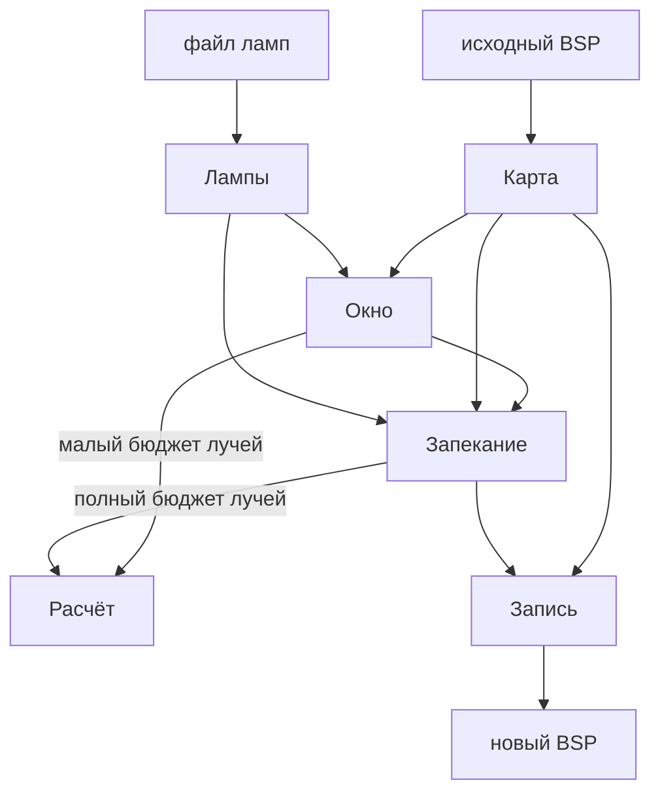

# Архитектура

Source Lightbaker открывает собранную карту, ставит лампы площадками и записывает новый BSP рядом с исходным. Garry's Mod этот файл только загружает. Окно и запекание вызывают один расчёт: картинка в окне — тот же свет, с меньшим числом лучей.

Язык модулей — в [CONTEXT.md](../CONTEXT.md). Цель — в [documents/concept.md](../documents/concept.md).

## Модули

Шесть модулей. Свет считается в одном месте. Файл BSP пишется в другом. Виды ламп не доходят до лучей.

Расчёт не читает байты BSP и не знает вид лампы. Запись не пускает лучи. Окно не подменяет расчёт своим рисованием света.

### Карта

Открывает BSP и больше ничего в нём не решает.

Вызывающий получает три вещи:

- треугольники геометрии и моделей из пака;
- приёмники — положение, норма, альбедо, роль (стена, пол или ни то ни другое) и то, куда свет ляжет (люксель лица, люксель пропа, вершина пропа);
- снимок для записи: копия всего, что не является светом, и места, куда свет будет вставлен.

Сетка люкселей уже есть. Карта её не выдумывает. Проп без своего лайтмапа отдаёт вершины, проп с лайтмапом — люксели.

Файл, который не является картой Source 1 или в котором нет сетки люкселей, не открывается.

Карта не знает лампы, бюджет лучей и окно.

### Лампы

Файл рядом с картой. В BSP этих ламп нет, и запекание их туда не кладёт.

Лампа хранит вид и положение. Наружу для расчёта выходит площадка: форма, положение, сила, цвет. Вид остаётся здесь.

- Люминесцент — единица силы, длинный прямоугольник вниз.
- Остальные виды — доли этой силы.
- Колба — диск у прутьев; центр луча встречает пол впереди решётки.
- Бра и камера — малые диски.
- Аварийная — короткий красный диск.

Нет файла ламп — пустой набор, карта всё равно открывается.

### Расчёт

Единственное место, где есть свет.

Вход: треугольники, приёмники, площадки, бюджет лучей.

Выход: линейный свет на каждом приёмнике и список площадок внутри глухой оболочки.

Бюджет меняет только число лучей. Пометка глухой оболочки от бюджета не зависит: окно и файл согласны, какая лампа глухая. Свет такой площадки в выход не входит.

Порядок снаружи не выбирается.

1. Прямой свет. Спад `1/r²` от ближайшей точки площадки. Тень — доля лучей, дошедших до поверхности, поэтому край мягкий.
2. Два диффузных отскока от стен. Альбедо стены входит в отскок.
3. Подъём почти чёрного пола к уже посчитанному отскоку. У подъёма нет положения в проходе и нет отдельной лампы.

Решётка — треугольники модели из входа. Щель пропускает луч, потому что треугольника нет.

Записанный свет — то, что пришло на поверхность. Собственное альбедо приёмника в эту величину не умножается: Garry's Mod умножит текстуру сам.

Один и тот же вход и тот же бюджет дают тот же свет.

Расчёт не открывает BSP, не пишет файл и не знает колбу от бра.

Проверяется он треугольниками, приёмниками и площадками, без карты на диске.

### Запись

Кладёт уже посчитанный линейный свет в новый BSP.

Вход: снимок карты, свет приёмников, путь назначения.

Путь назначения — другой файл рядом с исходным. Тот же путь, что у исходной карты, — отказ. Игру запись не запускает.

LDR и HDR — две упаковки одного линейного света, не два прогона. Пишется только стиль 0. Прежний свет карты не смешивается с новым: комки света заменяются.

- Люксель лица — в световые комки LDR и HDR.
- Люксель пропа — в запись света этого пропа внутри пака.
- Вершина пропа — туда же, в запись вершин.

Пак копируется, затем в копии заменяются только эти записи света. Геометрия и видимость не перестраиваются. Если число света лежит на комке геометрии, меняется число, не сетка. Всё остальное, включая сущности карты, копируется как есть: из сущностей лампы не читаются.

Запись проверяется снимком и готовым светом, без лучей.

### Запекание

Вызывает расчёт с полным бюджетом и отдаёт результат записи.

Малый бюджет окна сюда передать нельзя. Своего света у запекания нет.

### Окно

Открывает карту и лампы, двигает лампы, вызывает расчёт с малым бюджетом и рисует полученный свет на поверхностях.

Сдвиг взгляда расчёт не повторяет: картинка — свет на приёмниках, а не отдельный вид из камеры. Сдвиг лампы повторяет расчёт.

Площадку внутри глухой оболочки окно помечает. В файл её свет не попадает, потому что расчёт его уже не вернул.

По команде запечь окно вызывает запекание. Исходную карту окно не пишет и игру не запускает.

## Чего нет

- Второго света для окна: растеризации, точечных заменителей ламп, отдельного трассировщика.
- Ламп из VMF, из сущностей BSP, солнца и неба. Светят только площадки из файла ламп.
- Ламп наполнения. Подъём — не источник.
- Source 2, сборки карты, запуска Garry's Mod, выкладки файла на сервер.

## Стек

Один язык на все шесть модулей — Rust. Крейты повторяют модули: расчёт не зависит от карты, запись не зависит от расчёта. Это и есть запрет читать байты BSP из лучей.

Пересечение луча живёт внутри расчёта и считается через Embree 4. Связка наша: готовые крейты-обёртки заброшены. Окно на eframe — egui поверх wgpu — и только рисует уже посчитанный свет. Приёмники считаются параллельно через rayon. Пак читается как zip.

Число лучей, доли яркости видов и байты файла ламп по-прежнему внутри модулей.
